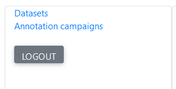
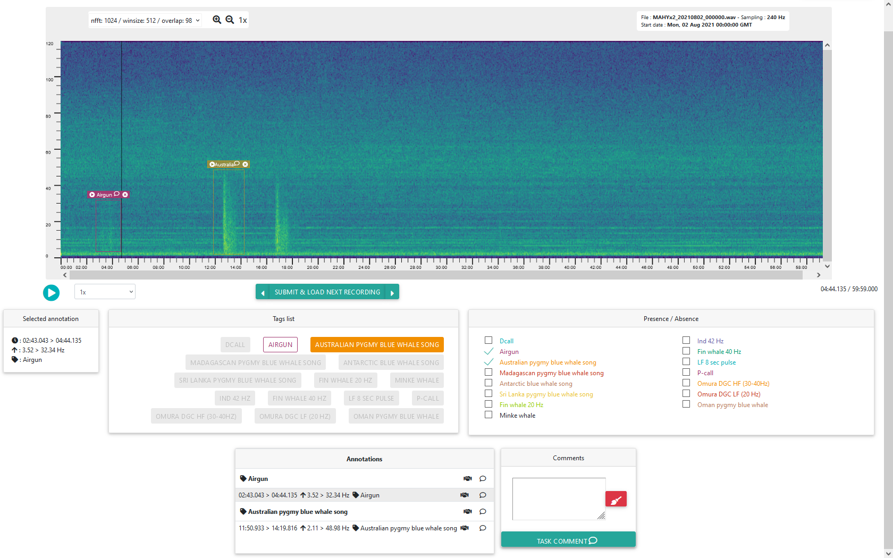
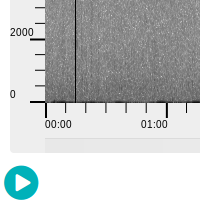
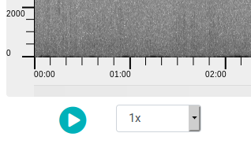
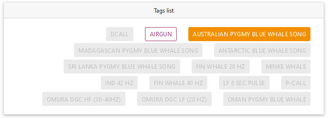
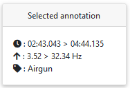
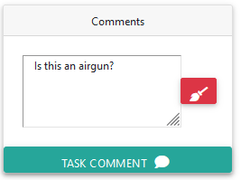
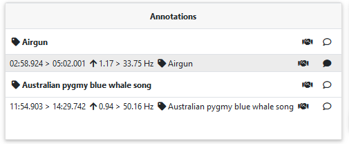

# APLOSE Annotator User Guide

## Application overview

### Login

Login pages allow the user to authenticate to the website. 
There is currently no sign in feature: users are created by the website administrators, who send the credentials to the campaign manager or to the users.

### Navigation

For data management pages, a menu area is displayed on the left side of the page. It gives access to Datasets overview, Campaigns overview, and a logout feature.

### Campaigns overview

Annotation campaigns page is an overview of all available campaigns for the user currently logged in. 
For each campaign, there is a link to the Task list at the end of the line.

### Task list

The Annotation Tasks page lists the tasks for a given campaign, for the user currently logged in.

| Column   | Content                                                                   |
|----------|---------------------------------------------------------------------------|
| Filename | name of the task file                                                     |
| Dataset  | short name of the dataset                                                 |
| Date     | when this file was recorded                                               |
| Duration | duration of the task file                                                 |
| Status   | Created if the user hasn’t begun to annotate the file, Finished otherwise |
| Link     | a link to the Audio Annotator page for this task                          |

## Audio annotator

### Overview

This is the main page of the site: it allows to annotate a spectrogram visualization of a sound file. 
The spectrogram is labelled with time and frequency axes.

If this task has been annotated and submitted previously, the application will load and display previous annotations. Like new ones, these annotations can be modified or deleted.

The sound file is playable by clicking on the play / pause button under the spectrogram. A thin black playback bar is displayed over the spectrogram.

### Playback rate (only on Firefox)

The speed at which the sound file is played can be changed from a select list displayed (only on Firefox) next to the play button. Available speeds are 0.25x, 0.5x, 1x, 1.5x, 2x, 3x and 4x. 
There is no pitch correction so modifying the playback rate also modifies the frequency.

### Control panel / zoom

The control panel allows to change the way the spectrogram is displayed. 
With the select list, the user can choose the way the spectrogram was generated among available settings.

A zooming feature is available by two means:

- Clicking / tapping the buttons on the control panel: the spectrogram is centered on the progress bar
- Scrolling over the spectrogram with a mouse or a touch pad: the spectrogram is center on the cursor position

The spectrogram only zooms on time (no zoom on frequency). The zoom is discrete: each zoom level offers pre-computed spectrograms, meaning levels are decided by the creator of the dataset.

### Create, tag, select and delete an annotation

There is two types of annotations : presence tag and box tag.
The presence tag indicate a presence in the whole file, the box tag only in the selected time/frequency area.
For each box tag label there is a presence tag for the same label.

To create a presence tag you need to check the wanted label in the "Presence / Absence" block.

To create a box annotation, click on the spectrogram and drag over the area containing the feature. 
On click / tap release, the annotation is created and selected: it appears in Selected annotation block and in the Annotations list, both below the spectrogram.

By default, the last tag selected is used to label your new annotation. You can switch your box tag by click on the corresponding button in the "Tags list" block.
Note that only selected presence tag can be used to annotate box.

### Selected annotation

The selected annotation block gives precise details about the annotation: start and end time, min and max frequency.
An annotation must have one and only one tag.

It also lists available tags (from the dataset). To tag / untag the annotation, press the matching button.

The selected annotation can be chosen by clicking on its header on the spectrogram, or its line on the annotation list. 
The header also allow playing the sound file only for the duration of the annotation, and deleting the annotation by pressing corresponding buttons.

### Comments

You can also edit a comment for each annotation, or for the task.

### Annotation list

All the annotations created by the user for the current task are listed in the annotations list block, sorted by start time.

Table content:

- Start / end time for boxes
- Min / max frequency for boxes
- Tag, “-” if no tag has been selected yet
- Confidence level, if the campaign allows it
- An indicator of comment on the annotation

Clicking on an annotation selects it (it appears it the selected annotation block and can be tagged).

### Submit / navigation

The Submit & load next recording button works this way:

- If several annotations are not tagged, it displays an error message and stay on this task
- If all annotations are tagged (or if no annotation has been created), it saves them for this task, and loads the next available task
- If there is no next available task, the user is sent back to the task list for this campaign.

